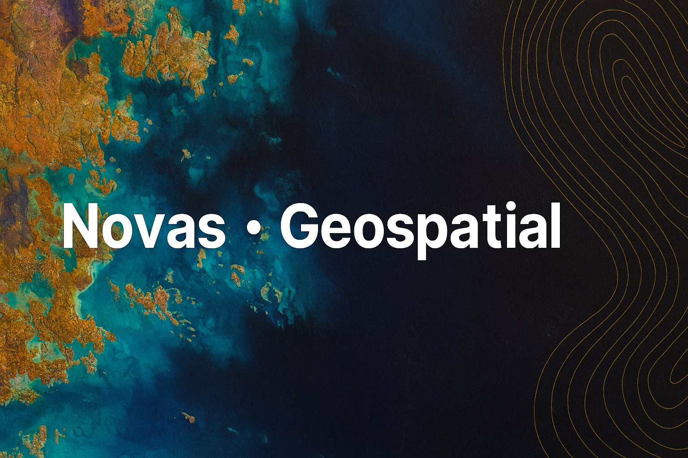

# novas-geo.github.io
## 🗺️ Geospatial Learning Dashboard

Welcome to my interactive roadmap for mastering open-source geospatial tools and delivering EUDR-compliant datasets.

### 🎨 Difficulty Scale
- 🟢 Basic – Setup, exploration, introductory tasks
- 🟡 Intermediate – Scripting, spatial queries, integration
- 🔴 Advanced – Remote sensing, modeling, final delivery

### 📅 Weekly Modules

| Week | Dates | Module | Difficulty | Goal |
|------|-------|--------|------------|------|
| 1 | Sept 12–18 | QGIS Fundamentals | 🟢 | Install QGIS, explore layers |
| 2 | Sept 19–26 | QGIS Fundamentals | 🟢 | Edit geometries, export GeoJSON |
| 3–5 | Sept 27–Oct 17 | Python for GIS | 🟡 | GeoPandas, Folium, scripting |
| 6–7 | Oct 18–31 | PostGIS | 🟡 | Spatial DB, SQL queries |
| 8–10 | Nov 2–23 | Remote Sensing | 🔴 | NDVI, Sentinel, classification |
| 11–12 | Nov 24–Dec 8 | GEE | 🔴 | Cloud-based analysis |
| 13–15 | Dec 9–29 | ML Geospatial | 🔴 | Clustering, supervised models |
| 16–17 | Dec 30–Jan 12 | Web Mapping | 🟡 | Folium, Kepler.gl dashboards |
| 18–20 | Jan 13–31 | Final Project – EUDR | 🔴 | Validation, packaging, submission

📘 [View my EUDR Compliance Guide](./EUDR_Compliance_Guide_EN.md)  
📁 [Explore my GitHub Portfolio](https://github.com/novass-geo)

